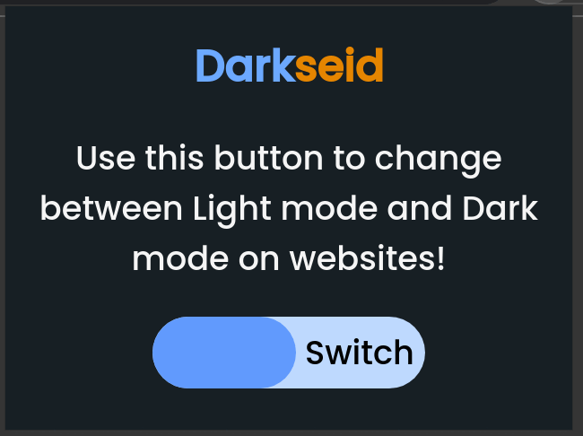
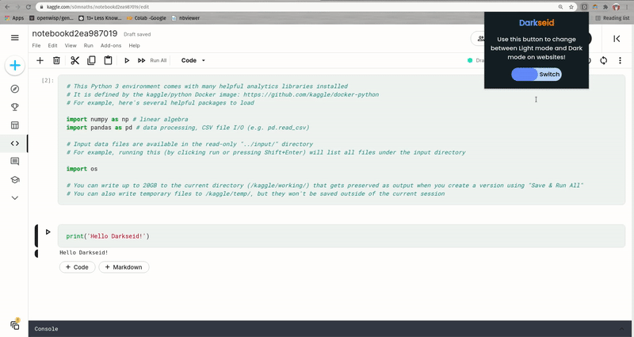

# Darkseid
A simple Chrome extension which enables dark mode on any web page. 

### To try it out
1. Clone this repository.
2. In Chrome, open the **Extension Management** page by navigating to `chrome://extensions`.
3. Enable Developer Mode by clicking the toggle switch next to **Developer mode**.
4. Click the **Load unpacked** button and select the repo directory.
 
:alien: *Now you're one with the __Darkseid__* :alien:

### Why I made this
I was going through notebooks on Kaggle.com and wondered the site had dark mode, sadly it didn't. So I wanted to make my own dark mode enabler.

Now I can code without torturing my eyes all night long :monocle_face: 
